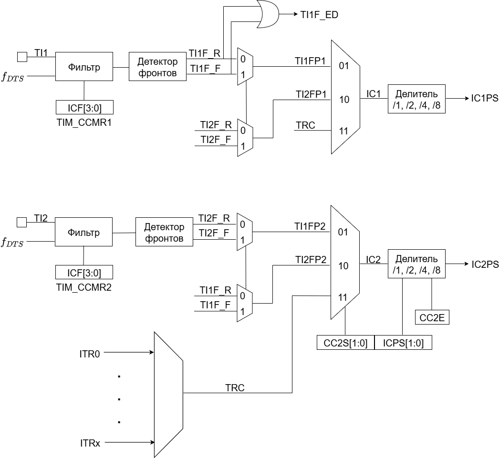
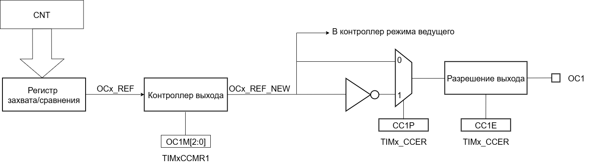

== Общее описание

В состав таймера входят 3 основных блока:  
[ol]
1. Time-base unit.  
2. Master/Slave Mode Controller.  
3. TIM_CHANNEL.

=== Time-base unit

Данный блок включает в себя:  
[ul]
 * Основной счетчик таймера CNT
 * Регистр автоматической перезагрузки (ARR)  
    Данный регистр задает основание счета для счетчика CNT. Счетчик регулярно сравнивает свое значение со значением из ARR. Когда происходит overflow (при счете вверх) или underflow (при счете вниз), генерируется сигнал UEV (Update Event).  
    ARR состоит из двух регистров:  
    ** *Preload Register*  — регистр предварительной загрузки. Этот регистр можно настраивать через программный интерфейс. Когда формируется событие UEV, значение из регистра предварительной загрузки помещается в теневой регистр.
    ** *Shadow Register* — теневой или активный регистр. Теневой регистр является _внутренним_ и недоступен программисту. Именно с теневым регистром происходит сравнение значения счетчика.  
 * Prescaler (PSC) — программно настраиваемый делитель частоты. Служит для деления частоты, тактирующей основной счетчик CNT. Программный регистр делителя, который содержит коэффициент деления, также имеет теневой регистр. Приницп работы такой же, как и для ARR.

==== Режим счета вверх
В этом режиме счетчик считает вверх от 0 до значения в регистре автоматической перезагрузки (ARR). Этот режим включается путем установки бита DIR = 0 в программном регистре TIM_CR1. При переполнении счетчика генерируется событие UEV (Update Event), также выставляется флаг прерывания UIF (Update Interrupting Flag).  
Событие обновления (UEV) может быть отключено путем программной установки значения UDIS в регистре TIMx_CR1. Это позволяет не обновлять теневые регистры во время записи новых значений в регистры предварительной загрузки.

==== Режим счета вниз
В этом режиме счетчик считает от значения в регистре автоматической перезагрузки (ARR) до 0. Этот режим включается путем установки DIR = 1 в регистре TIM_CR1. Когда счетчик досчитывает до 0, генерируется событие «анти переполнения» (underflow).

==== Режим счета вверх-вниз
В этом режиме счетчик считает от 0 до значение TIM_ARR – 1, генерирует событие переполнения счетчика (overflow), затем начинает считать от значения TIM_ARR до 1, после чего генерирует событие «анти переполнения» счетчика (underflow).  
В этом режиме управление направлением счета осуществляется другим способом(поле DIR недоступно для записи). Поле DIR будет перезаписываться аппаратно, когда счетчик изменит направление счета. Для управления счетчиком используются биты CMS регистра TIM_CR1.  

Собыие обновление (UEV) может генерироваться:
[ul]
 * При каждом *overflow*
 * При каждом *underflow*
 * При установке бита UG в регистре TIM_EGR (программно или с помощью *Slave Mode Controller*)  

Генерацию события можно запретить установив бит UDIS в регистре TIM_CR1.  
Обычно, когда генерируется событие UEV, то вместе с ним формируется флаг UIF (Update Interrupt Flag). Но если установить бит URS в регистре TIM_CR1, то запрос на прерывание формироваться не будет.  

Флаг UIF формируется в одноименном поле в статусном регистре таймера TIM_SR1.

=== Master/Slave Mode Controller 
==== Slave Mode Controller
Этот блок формирует управляющие сигналы для блока Time-base unit. Также этот блок может обрабатывать внешние события (ETR) и генерировать события для других таймеров (TRGO).  
В этом блоке есть схема для выбора источника тактирования основного счетчика. Тактирование может осуществляться следующими источниками:  
[ul]
 * Внутренний тактовый сигнал F~CKINT~
 * Режим внешнего тактирования №1: таковый сигнал берется с вывода канала таймера TIMx.  
 * Режим внешнего тактирования №2: внешний тактовый сигнал поступает на вход внешнего триггера (ETR).  
 * Внутренние триггеры от других таймеров TIMx.

image::../img/clock_select.png[Choice clock source, 1000, 800]

==== Master Mode Controller
Таймер может не только принимать и реагировать на внешние события, также он может генерировать события TRGO для других таймеров. Таким образом, можно делать каскады из таймеров.  
*Master Mode Controller* может работать в следующих режимах:  
[ul]
 * Один таймер явялется преддедлителем для другого таймера (one timer prescaler for another)  
 * Один таймер генерирует сигнал *enable* для другого таймера (one timer enable for another)  
 * Один таймер запускает другой таймер (one timer to tart for another timer)  

=== TIM_CHANNEL
Канал таймера можно сконфигурировать на вход (режим захвата) и на выход (режим сравнения).

==== Режим захвата  
На схеме ниже представлены 2 канала таймера, которые сконфигурированы в режиме входа (захвата). 
С вывода МК сигнал поступает на фильтр, где отбрасываются импульсы, длительность которых меньше заданной. Дальше сигнал попадает на детектор фронтов. Дальше идет мультиплексор, который выбирает необходимую полярность сигнала. То есть на этом этапе принимается решение, на какое событие будет реагировать регистр захвата/сравнения (CCRx) — передний фронт сигнала или задний. В результате мультиплексирования получается сигнал ICx, который попадает на делитель частоты. Делитель нужен для того, чтобы регистр захвата не перехватывал значение счетчика очень часто — это сильно снижает производительность всей системы. В конечном итоге формируется сигнал ICxPS Сигнал *ICxPS* — сигнал, который управляет регистром захвата/сравнения. Когда *ICxPS* активен, происходит захват значения счетчика, и выставляется сигнал *CCx_IF* в статусном регистре TIMx_SR, если этот флаг установлен, т выставляется флаг повторного захвата *CCxOF* в том же статусном регистре.

==== Input PWM Mode
Режим входного ШИМ-сигнала является частным случаем режима захвата. Для этого сигнала с одного канала (например, TI1) надо разветвить и направить на выход 1 и 2. Сигнал TI1FP1 будет управлять регистром CCR1, а сигнал TI1FP2 — CCR2. Таким образом для сигнала TI1FP1 можно настроить активный фронт — передний, а для сигнала TI1FP2 — задний. И в момент переднего фронта сигнала в регистр CCR1 будет сохраняться одно значение счетчика. В момент заднего фронта сигнала в регистр CCR2 будет сохраняться следующее значение счетчика. В итоге, мы сможем посчитать скважность входного сигнала по формуле:  
*Duty cycle* = CCR2 \ CCR1 * 100%  

==== Режим сравнения  

В режиме сравнения вывод таймера сконфигурирован как выход. Когда значение счетчика совпадает со значением регистра захвата/сравнения TIM_CCR, то уровень выходного сигнала меняется в зависимости от поля OCxM в регистре TIM_CCMR. Сигнал обновления UEV не влияет ни на счет, ни на выходной сигнал таймера.  
Можно генерировать прерывания и запрос к DMA.  

==== One Pulse Mode — Режим стробирования
В этом режиме таймер может генерировать сигнал с программируемой длительностью. Этот режим включается установкой бита OPM в регистре TIMx_CR1. Это приводит к автоматической остановке счетчика при следующем событии обновления (UEV).  
*Замечание:* Импульс будет корректно сгенерирован только в следующих случаях:  
[ul]
 * При счете *верх*: CNT < TIMx_CCR < TIMx_ARR  
 * При счете *вниз:* CNT > TIMx_CCR  

Импульс может быть сгенерирован с определенной длительностью (определяется как TIMx_ARR - TIMx_CCR + 1) и с конкретной задержкой (задается значением TIMx_CCR) после прихода триггера на вход таймера.
