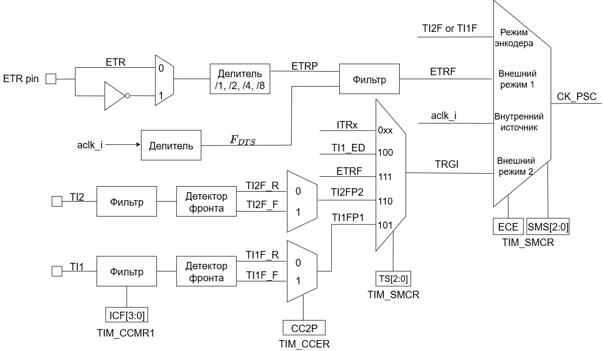

== Общее описание
В состав таймера входят 3 основных блока:  
[ol]
1. Time-base unit.  
2. Master/Slave Mode Controller.  
3. Канал TIM.

=== Time-base unit
Данный блок включает в себя:  
[ul]
 * Основной счетчик таймера CNT
 * Регистр автоматической перезагрузки (ARR)  
    Данный регистр задает основание счета для счетчика CNT. Счетчик регулярно сравнивает свое значение со значением из ARR. Когда происходит overflow (при счете вверх) или underflow (при счете вниз), генерируется сигнал UEV (Update Event).  
    ARR состоит из двух регистров:  
    ** *Preload Register*  — регистр предварительной загрузки. Этот регистр можно настраивать через программный интерфейс. Когда формируется событие UEV, значение из регистра предварительной загрузки помещается в теневой регистр.
    ** *Shadow Register* — теневой или активный регистр. Теневой регистр является _внутренним_ и недоступен программисту. Именно с теневым регистром происходит сравнение значения счетчика.  
 * Prescaler (PSC) — программно настраиваемый делитель частоты. Служит для деления частоты, тактирующей основной счетчик CNT. Программный регистр делителя, который содержит коэффициент деления, также имеет теневой регистр. Приницп работы такой же, как и для ARR.

==== Режим счета вверх
В этом режиме счетчик считает вверх от 0 до значения в регистре автоматической перезагрузки (ARR). Этот режим включается путем установки бита DIR = 0 в программном регистре TIM_CR1. При переполнении счетчика генерируется событие UEV (Update Event), также выставляется флаг прерывания UIF (Update Interrupting Flag).  
Событие обновления (UEV) может быть отключено путем программной установки значения UDIS в регистре TIMx_CR1. Это позволяет не обновлять теневые регистры во время записи новых значений в регистры предварительной загрузки.

==== Режим счета вниз
В этом режиме счетчик считает от значения в регистре автоматической перезагрузки (ARR) до 0. Этот режим включается путем установки DIR = 1 в регистре TIM_CR1. Когда счетчик досчитывает до 0, генерируется событие «анти переполнения» (underflow).

==== Режим счета вверх-вниз
В этом режиме счетчик считает от 0 до значение TIM_ARR – 1, генерирует событие переполнения счетчика (overflow), затем начинает считать от значения TIM_ARR до 1, после чего генерирует событие «анти переполнения» счетчика (underflow).  
В этом режиме управление направлением счета осуществляется другим способом(поле DIR недоступно для записи). Поле DIR будет перезаписываться аппаратно, когда счетчик изменит направление счета. Для управления счетчиком используются биты CMS регистра TIM_CR1.  

Собыие обновление (UEV) может генерироваться:
[ul]
 * При каждом *overflow*
 * При каждом *underflow*
 * При установке бита UG в регистре TIM_EGR (программно или с помощью *Slave Mode Controller*)  

Генерацию события можно запретить установив бит UDIS в регистре TIM_CR1.  
Обычно, когда генерируется событие UEV, то вместе с ним формируется флаг UIF (Update Interrupt Flag). Но если установить бит URS в регистре TIM_CR1, то запрос на прерывание формироваться не будет.  

Флаг UIF формируется в одноименном поле в статусном регистре таймера TIM_SR1.

=== Slave Mode Controller
Этот блок формирует управляющие сигналы для блока Time-base unit. Также этот блок может обрабатывать внешние события (ETR) и генерировать события для других таймеров (TRGO).  
В этом блоке есть схема для выбора источника тактирования основного счетчика. Тактирование может осуществляться следующими источниками:  
[ul]
 * Внутренний тактовый сигнал F~CKINT~
 * Режим внешнего тактирования №1: таковый сигнал берется с вывода канала таймера TIMx.  
 * Режим внешнего тактирования №2: внешний тактовый сигнал поступает на вход внешнего триггера (ETR).  
 * Внутренние триггеры от других таймеров TIMx.

Пример. Настроить счет вверх по фронту сигнала на входе TI2.  
[ol]
1. Сперва необходимо сконфигурировать вывод TI2 как *вход*. Для этого нужно установить поле *CC2S* = 01 в регистре TIMx_CCMR1.
2. Нужно задать коэффициент фильтра для генерации сигнала TI2F без ненужных помех. Это можно сделать, установив поле *IC2F* регистра TIMx_CCMR1 в необходимое значение.
3. Теперь необходимо выбрать полярность сигнала. То есть на какой фронт будет реагировать счетчик. Это можно сделать с помощью полей CC2P и CCN2P в регистре TIMxCCER.
4. Необходимо настроить таймер на выбор сигнала тактирования с вывода TI2, записав *TS=110* в регистр TIMx_SMCR.
5. Необходимо настроить таймер на режим внешнего тактирования №1, установив поле *SMS* = 111 в регистр TIMx_SMCR.
6. Включить счетчик, установив поле *CEN = 1* в регистре TIMx_CR1.
Когда на входе TI2 происходит фронт, счётчик отсчитывает один раз, и устанавливается флаг TIF.

=== Синхронизация таймера с внешними сигналами
Таймеры могут быть синхронизированы с внешними событиями в трех режимах:  
[ul]
* Режим сброса  
* Режим стробирования
* Триггерный режим  

==== Режим сброса  
Например, можно сбрасывать счетчик по переднему или по заднему фронту сигнала с канала TI1. Для этого необходимо:  
[ol]
 1. Настроить фильтр входного сигнала в канале TI1, задав небходимую длительность сигнала с помощью поля IC1F в регистре TIM_CCMR1.  
 2. Выбрать фронт, по которому будет происходить сброс таймера (передний или задний). Это делается с помощью настройки поля CC1P в регистре TIM_CCER.  
 3. Далее нужно выбрать событие для сигнала TRGI. В данном примере нужно мультиплексировать значение сигнала TI1 на провод TRGI. Для этого необходимо настроить поле *TS = 101* в регистре TIM_SMCR.  
 4. Далее нужно выбрать режим внешнего тактирования. Необходимо выбрать тактирование сигналом TRGI и установить режим сброса. Для этого нужно установить поле ECE регистра TIM_SMCR в 0, а поле *SMS = 100*.  
 5. Теперь по заданному фронту сигнала на канале TI1 будет происходить сброс основного счетчика CNT и обновление теневых регистров TIM_ARR и TIM_CCRx, если буфферизация этих регистров включена.

==== Режим стробирования  
 В этом режиме запуск/остановка счетчика зависит от уровня внешнего сигнала. Например, можно контролировать работу основного счетчика CNT c помощью сигнала с канала TI1. Для этого необходимо:
[ol]
1. Настроить фильтр входного сигнала в канале TI1, задав небходимую длительность сигнала с помощью поля IC1F в регистре TIM_CCMR1.  
2. Выбрать фронт, по которому будет происходить запуск или остановка таймера (передний или задний). Это делается с помощью настройки поля CC1P в регистре TIM_CCER.   
3. Далее нужно выбрать событие для сигнала TRGI. В данном примере нужно мультиплексировать значение сигнала TI1 на провод TRGI. Для этого необходимо настроить поле *TS = 101* в регистре TIM_SMCR. 
4. Далее нужно выбрать режим внешнего тактирования. Необходимо выбрать тактирование сигналом TRGI и установить режим стробирования. Для этого нужно установить поле ECE регистра TIM_SMCR в 0, а поле *SMS = 101*.  
5. Теперь работа счетчика регулируется уровнем сигнала на канале TI1. При запуске или остановке счетчика устанавливается флаг TIF в регистре TIM_SR1. Если разрешены генерация прерывания или запросы к DMA, то они также будут сгенерированы.  

==== Режим триггера   
В этом режиме счетчик может быть запущен по внешнему событию на входе.
[ol]
1. Настроить фильтр входного сигнала в канале TI1, задав небходимую длительность сигнала с помощью поля IC1F в регистре TIM_CCMR1.  
2. Выбрать фронт, по которому будет происходить запуск таймера (передний или задний). Это делается с помощью настройки поля CC1P в регистре TIM_CCER.   
3. Далее нужно выбрать событие для сигнала TRGI. В данном примере нужно мультиплексировать значение сигнала TI1 на провод TRGI. Для этого необходимо настроить поле *TS = 101* в регистре TIM_SMCR. 
4. Далее нужно выбрать режим внешнего тактирования. Необходимо выбрать тактирование сигналом TRGI и установить режим стробирования. Для этого нужно установить поле ECE регистра TIM_SMCR в 0, а поле *SMS = 110*.  
5. Теперь можно запускать основной счетчик CNT по заданному фронту сигнала на канале TI1.  

=== Master Mode Controller
Таймер может не только принимать и реагировать на внешние события, также он может генерировать события TRGO для других таймеров. Таким образом, можно делать каскады из таймеров.  
*Master Mode Controller* может работать в следующих режимах:  
[ul]
 * Один таймер явялется преддедлителем для другого таймера (one timer prescaler for another)  
 * Один таймер генерирует сигнал *enable* для другого таймера (one timer enable for another)  
 * Один таймер запускает другой таймер (one timer to tart for another timer)  

==== One timer is prescaler for another

image::../img/prescaler_to_another.png[1000, 800]

Как представлено на схеме выше, есть возможность использовать таймер №1, например, в качестве предделителя для таймера №2. Для этого необхожимо:  
[ol]
 1. Сконфигурируем Таймер №1 для работы в режиме ведущего устройства.  
 2. Таймер №2 должен быть сконфигурирован в режиме ведомого устройства.  
 3. Затем контроллер ведомого режима должен быть переведен в режим внешнего тактирования 1 (записью SMS=111 в регистр TIM2_SMCR). Это приводит к тому, что Таймер 2 начинает тактироваться по переднему фронту периодического триггерного сигнала от Таймера 1.  
 4. Оба таймера должны быть включены, путем установки битов CEN в регистры TIM1_CR1 и TIM2_CR1.  

==== One timer enable for another  
В этом режиме сигнал разрешения для таймера №2 генерируется с помощью сравнения основного счетчика CNT таймера №1 с его регистром захвата/сравнения. То есть, активирующим сигналом таймера №2 является сигнал OCREF1, который формируется в результате сравнения значения основного счетчика и значения в регистре CCR.

==== One timer to start another
В этом режиме Таймер №2 начинает счет, когда Таймер №1 генерирует событие обновление UEV (update Event). UEV генерируется когда значение основного счетчика CNT таймера №1 совпадает со значением TIM1_ARR.  
[ol]
 1. Необходимо сконфигурировать Таймер №1 в режиме ведущего (Master Mode). Для того чтобы сигнал TRGO формировался в зависимости от сигнала UEV нужно установить значение *MMS = 010* в регистре TIM1_CR2.  
 2. Теперь нужно задать основание счета, то есть загрузить значение в регистр автоперезагрузки TIM1_ARR.  
 3. Необходимо настроить Таймер №2 в режим ведомого, а именно в режим триггера, для чего нужно установить SMS = 110 в регистре TIM2_SMCR. Для того, чтобы Таймер №2 был чувствителен к сигналу UEV от Таймера №1, необходимо установить *TS = 000* в регистре TIM2_SMCR.  
 4. Наконец, необходимо запустить Таймер №1 с помощью установки *CEN = 1* в регистре TIM1_CR1.  

==== Активация двух таймеров от внешнего события  
В этом режиме Таймер №1 может работать как в режиме ведомого (входа внешнего события TI1), так и в режиме ведущего (относительно Таймера №2). Таким образом, сначала активируется Таймером №1, затем Таймер №2.  
[ol]
 1. Необходимо сконфигурировать Таймер №1 в режиме ведущего, для этого необходимо установить *MMS = 001* в регистре TIM1_CR2.  
 2. Необходимо сконфигурировать Таймер №1 в режиме ведомого для получения сигнала внешнего события с вывода TI1. Для этого необходимо установить *TS = 100* в регистр TIM1_SMCR.  
 3. Таймер №1 должен работать в конкретном режиме ведомого, а именно в режиме триггера, для этого необходимо установить *SMS = 110* в регистре TIM1_SMCR.  
 4. Таймер №1 должен быть в режиме Ведущий/Ведомый, установив *MSM=1* (регистр TIM1_SMCR).  
 5. Необходимо настроить Таймер №2 в режиме ведомого для получения сигнала с Таймера №1. Для этого нужно установить *TS = 000* в регистре TIM2_SMCR.  
 6. Также необходимо настроить Таймер №2 в триггерном режиме. Для этого нужно установить *SMS = 110* в регистре TIM2_SMCR.  

=== Канал TIM
Канал таймера можно сконфигурировать на вход (режим захвата) и на выход (режим сравнения).

==== Режим захвата  
На схеме ниже представлены 2 канала таймера, которые сконфигурированы в режиме входа (захвата). 
С вывода МК сигнал поступает на фильтр, где отбрасываются импульсы, длительность которых меньше заданной. Дальше сигнал попадает на детектор фронтов. Дальше идет мультиплексор, который выбирает необходимую полярность сигнала. То есть на этом этапе принимается решение, на какое событие будет реагировать регистр захвата/сравнения (CCRx) — передний фронт сигнала или задний. В результате мультиплексирования получается сигнал ICx, который попадает на делитель частоты. Делитель нужен для того, чтобы регистр захвата не перехватывал значение счетчика очень часто — это сильно снижает производительность всей системы. В конечном итоге формируется сигнал ICxPS Сигнал *ICxPS* — сигнал, который управляет регистром захвата/сравнения. Когда *ICxPS* активен, происходит захват значения счетчика, и выставляется сигнал *CCx_IF* в статусном регистре TIMx_SR, если этот флаг установлен, т выставляется флаг повторного захвата *CCxOF* в том же статусном регистре.

image::../img/TIM_capture_mode.png[1000, 800]

Пример. Захват значения счетчика в регистр TIMx_CCR1 по фронту сигнала TI1
[ol]
1. Выбрать активный вход, в данном примере — TI1. Для этого необходимо установить поле *CC1S = 01* в регистре TIMx_CCMR1.
2. Необходимо задать коэффициент фильтра.
3. Необходимо выбрать полярность сигнала с вывода TI1.
4. Настроить предделитель с помощью битов IC1PSв регистре TIMx_CCMR1.
5. Разрешить захват значения счетчика, установив бит *CC1E* в регистре TIMx_CCER.
6. Разрешить установку запроса прерывания или запрос к DMA с помощью установки полей *CC1IE* и *CC1DE* в регистре TIMx_DIER.

==== Input PWM Mode
Режим входного ШИМ-сигнала является частным случаем режима захвата. Для этого сигнала с одного канала (например, TI1) надо разветвить и направить на выход 1 и 2. Сигнал TI1FP1 будет управлять регистром CCR1, а сигнал TI1FP2 — CCR2. Таким образом для сигнала TI1FP1 можно настроить активный фронт — передний, а для сигнала TI1FP2 — задний. И в момент переднего фронта сигнала в регистр CCR1 будет сохраняться одно значение счетчика. В момент заднего фронта сигнала в регистр CCR2 будет сохраняться следующее значение счетчика. В итоге, мы сможем посчитать скважность входного сигнала по формуле:  
*Duty cycle* = CCR2 \ CCR1 * 100%  

==== Режим сравнения  
image::../img/tim_ch_as_output.png[1000, 700]

В режиме сравнения вывод таймера сконфигурирован как выход. Когда значение счетчика совпадает со значением регистра захвата/сравнения TIM_CCR, то уровень выходного сигнала меняется в зависимости от поля OCxM в регистре TIM_CCMR. Сигнал обновления UEV не влияет ни на счет, ни на выходной сигнал таймера.  
Можно генерировать прерывания и запрос к DMA.  

==== Output PWM Mode
Данный режим позволяет генерировать сигнал с частотой, определяемой значением регистра автоперезагрузки TIM_ARR, и скважностью, определяемой значением регистра TIM_CCR.
[ol] 
1. Необходимо выбрать режим ШИМ. Это делается путем записи 110 (Режим №1) или 111 (Режим №2) в поле *OCxM* регистра TIM_CCMR.
2. Далее включить предзагрузку регистров *TIM_ARR* и *TIM_CCR*. Это необходимо для того, чтобы в момент изменения одного из регистров не исказился сигнал ШИМ. Для включения предзагрузки регистра *TIM_ARR* необходимо установить *APRE* = 1 в регистре TIM_CR1. Для включения предзагрузки регистра TIM_CCRx необходимо установить *OCxPE* = 1 в регистре TIM_CCMRx.  
3. Теперь нужно загрузить значения из preload регистров в теневые регистры. Для этого можно программно сгенерировать сигнал обновления UEV (Update Event). Для этого необходимо установить бит *UG* в регистре TIMx_EGR.  
4. Необходимо настроить полярность выхода с помощью бита *CCxP* в регистре TIMx_CCER. Также нужно активировать выход с помощью установки бита *CCxE* в регистре TIM_CCERx.  

==== One Pulse Mode — Режим стробирования
В этом режиме таймер может генерировать сигнал с программируемой длительностью. Этот режим включается установкой бита OPM в регистре TIMx_CR1. Это приводит к автоматической остановке счетчика при следующем событии обновления (UEV).  
*Замечание:* Импульс будет корректно сгенерирован только в следующих случаях:  
[ul]
 * При счете *верх*: CNT < TIMx_CCR < TIMx_ARR  
 * При счете *вниз:* CNT > TIMx_CCR  

Импульс может быть сгенерирован с определенной длительностью (определяется как TIMx_ARR - TIMx_CCR + 1) и с конкретной задержкой (задается значением TIMx_CCR) после прихода триггера на вход таймера.
