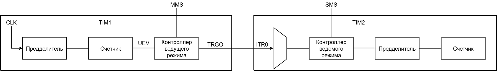

== Программирование

=== Сценарии для счета

==== Сценарий: Счет вверх
[ol]
1. Установить поле *DIR* = 0. Это настроит режим счета *вверх*.
2. Установить _autoreload_ значение. Для этого необходимо загрузить в регистр TIM_ARR значение — основание счета.
3. Далее, если предварительная загрузка регистра TIM_ARR включена (*APRE* = 1), то необходимо програмно сгенерировать событие обновления UEV. Это нужно для переноса
значения из _preload_ регистра TIM_ARR в теневой регистр — именно с ним работает основной счетчик. Для этого нужно установить бит *UG* в регистре TIM_EGR.
Если же *APRE* = 0, то значение ARR сразу попадет в теневой регистр.
4. Установить *CEN* = 1 в регистре TIM_CR1. Это запустит основной счетчик CNT.

==== Сценарий: Счет вниз
[ol]
1. Установить поле *DIR* = 1. Это настроит режим счета *вниз*.
2. Установить _autoreload_ значение. Для этого необходимо загрузить в регистр TIM_ARR значение — основание счета.
3. Далее, если предварительная загрузка регистра TIM_ARR включена (*APRE* = 1), то необходимо програмно сгенерировать событие обновления UEV. Это нужно для переноса
значения из _preload_ регистра TIM_ARR в теневой регистр — именно с ним работает основной счетчик. Для этого нужно установить бит *UG* в регистре TIM_EGR.
Если же *APRE* = 0, то значение ARR сразу попадет в теневой регистр.
4. Установить *CEN* = 1 в регистре TIM_CR1. Это запустит основной счетчик CNT.

==== Сценарий: Счет вверх-вниз
[ol]
1. Настроить поле *CMS*. Это настроит необходимый режим счета.
2. Установить _autoreload_ значение. Для этого необходимо загрузить в регистр TIM_ARR значение — основание счета.
3. Далее, если предварительная загрузка регистра TIM_ARR включена (*APRE* = 1), то необходимо програмно сгенерировать событие обновления UEV. Это нужно для переноса
значения из _preload_ регистра TIM_ARR в теневой регистр — именно с ним работает основной счетчик. Для этого нужно установить бит *UG* в регистре TIM_EGR.
Если же *APRE* = 0, то значение ARR сразу попадет в теневой регистр.
4. Установить *CEN* = 1 в регистре TIM_CR1. Это запустит основной счетчик CNT.

==== Сценарий: Счет вверх по фронту на канале TI2
[ol]
1. Сперва необходимо сконфигурировать вывод TI2 как *вход*. Для этого нужно установить поле *CC2S* = 01 в регистре TIMx_CCMR1.
2. Нужно задать коэффициент фильтра для генерации сигнала TI2F без ненужных помех. Это можно сделать, установив поле *IC2F* регистра TIMx_CCMR1 в необходимое значение.
3. Теперь необходимо выбрать полярность сигнала. То есть на какой фронт будет реагировать счетчик. Это можно сделать с помощью полей CC2P и CCN2P в регистре TIMxCCER.
4. Необходимо настроить таймер на выбор сигнала тактирования с вывода TI2, записав *TS=110* в регистр TIMx_SMCR.
5. Необходимо настроить таймер на режим внешнего тактирования №1, установив поле *SMS* = 111 в регистр TIMx_SMCR.
6. Включить счетчик, установив поле *CEN = 1* в регистре TIMx_CR1.
Когда на входе TI2 происходит фронт, счётчик отсчитывает один раз, и устанавливается флаг TIF.

=== Сценарии для синхронизации таймеров с внешними сигналами

==== Сценарий: Режим сброса
[ol]
 1. Настроить фильтр входного сигнала в канале TI1, задав небходимую длительность сигнала с помощью поля IC1F в регистре TIM_CCMR1.  
 2. Выбрать фронт, по которому будет происходить сброс таймера (передний или задний). Это делается с помощью настройки поля CC1P в регистре TIM_CCER.  
 3. Далее нужно выбрать событие для сигнала TRGI. В данном примере нужно мультиплексировать значение сигнала TI1 на провод TRGI. Для этого необходимо настроить поле *TS = 101* в регистре TIM_SMCR.  
 4. Далее нужно выбрать режим внешнего тактирования. Необходимо выбрать тактирование сигналом TRGI и установить режим сброса. Для этого нужно установить поле ECE регистра TIM_SMCR в 0, а поле *SMS = 100*.  
 5. Теперь по заданному фронту сигнала на канале TI1 будет происходить сброс основного счетчика CNT и обновление теневых регистров TIM_ARR и TIM_CCRx, если буфферизация этих регистров включена.

==== Сценарий: Режим стробирования
 В этом режиме запуск/остановка счетчика зависит от уровня внешнего сигнала. Например, можно контролировать работу основного счетчика CNT c помощью сигнала с канала TI1. Для этого необходимо:
[ol]
1. Настроить фильтр входного сигнала в канале TI1, задав небходимую длительность сигнала с помощью поля IC1F в регистре TIM_CCMR1.  
2. Выбрать фронт, по которому будет происходить запуск или остановка таймера (передний или задний). Это делается с помощью настройки поля CC1P в регистре TIM_CCER.   
3. Далее нужно выбрать событие для сигнала TRGI. В данном примере нужно мультиплексировать значение сигнала TI1 на провод TRGI. Для этого необходимо настроить поле *TS = 101* в регистре TIM_SMCR. 
4. Далее нужно выбрать режим внешнего тактирования. Необходимо выбрать тактирование сигналом TRGI и установить режим стробирования. Для этого нужно установить поле ECE регистра TIM_SMCR в 0, а поле *SMS = 101*.  
5. Теперь работа счетчика регулируется уровнем сигнала на канале TI1. При запуске или остановке счетчика устанавливается флаг TIF в регистре TIM_SR1. Если разрешены генерация прерывания или запросы к DMA, то они также будут сгенерированы. 

==== Сценарий: Режим триггера
В этом режиме счетчик может быть запущен по внешнему событию на входе.
[ol]
1. Настроить фильтр входного сигнала в канале TI1, задав небходимую длительность сигнала с помощью поля IC1F в регистре TIM_CCMR1.  
2. Выбрать фронт, по которому будет происходить запуск таймера (передний или задний). Это делается с помощью настройки поля CC1P в регистре TIM_CCER.   
3. Далее нужно выбрать событие для сигнала TRGI. В данном примере нужно мультиплексировать значение сигнала TI1 на провод TRGI. Для этого необходимо настроить поле *TS = 101* в регистре TIM_SMCR. 
4. Далее нужно выбрать режим внешнего тактирования. Необходимо выбрать тактирование сигналом TRGI и установить режим стробирования. Для этого нужно установить поле ECE регистра TIM_SMCR в 0, а поле *SMS = 110*.  
5. Теперь можно запускать основной счетчик CNT по заданному фронту сигнала на канале TI1.  

=== Сценарии для комбинации нескольких таймеров

==== Сценарий: Один таймер явялется преддедлителем для другого таймера

 

В этом режиме сигнал разрешения для таймера №2 генерируется с помощью сравнения основного счетчика CNT таймера №1 с его регистром захвата/сравнения. То есть, активирующим сигналом таймера №2 является сигнал OCREF1, который формируется в результате сравнения значения основного счетчика и значения в регистре CCR.
[ol]
 1. Сконфигурируем Таймер №1 для работы в режиме ведущего устройства.  
 2. Таймер №2 должен быть сконфигурирован в режиме ведомого устройства.  
 3. Затем контроллер ведомого режима должен быть переведен в режим внешнего тактирования 1 (записью SMS=111 в регистр TIM2_SMCR). Это приводит к тому, что Таймер 2 начинает тактироваться по переднему фронту периодического триггерного сигнала от Таймера 1.  
 4. Оба таймера должны быть включены, путем установки битов CEN в регистры TIM1_CR1 и TIM2_CR1.  

==== Сценарий: Один таймер запускает другой таймер

В этом режиме Таймер №2 начинает счет, когда Таймер №1 генерирует событие обновление UEV (update Event). UEV генерируется когда значение основного счетчика CNT таймера №1 совпадает со значением TIM1_ARR.  
[ol]
 1. Необходимо сконфигурировать Таймер №1 в режиме ведущего (Master Mode). Для того чтобы сигнал TRGO формировался в зависимости от сигнала UEV нужно установить значение *MMS = 010* в регистре TIM1_CR2.  
 2. Теперь нужно задать основание счета, то есть загрузить значение в регистр автоперезагрузки TIM1_ARR.  
 3. Необходимо настроить Таймер №2 в режим ведомого, а именно в режим триггера, для чего нужно установить SMS = 110 в регистре TIM2_SMCR. Для того, чтобы Таймер №2 был чувствителен к сигналу UEV от Таймера №1, необходимо установить *TS = 000* в регистре TIM2_SMCR.  
 4. Наконец, необходимо запустить Таймер №1 с помощью установки *CEN = 1* в регистре TIM1_CR1.  

==== Сценарий: Активация двух таймеров от внешнего события

В этом режиме Таймер №1 может работать как в режиме ведомого (входа внешнего события TI1), так и в режиме ведущего (относительно Таймера №2). Таким образом, сначала активируется Таймером №1, затем Таймер №2.  
[ol]
 1. Необходимо сконфигурировать Таймер №1 в режиме ведущего, для этого необходимо установить *MMS = 001* в регистре TIM1_CR2.  
 2. Необходимо сконфигурировать Таймер №1 в режиме ведомого для получения сигнала внешнего события с вывода TI1. Для этого необходимо установить *TS = 100* в регистр TIM1_SMCR.  
 3. Таймер №1 должен работать в конкретном режиме ведомого, а именно в режиме триггера, для этого необходимо установить *SMS = 110* в регистре TIM1_SMCR.  
 4. Таймер №1 должен быть в режиме Ведущий/Ведомый, установив *MSM=1* (регистр TIM1_SMCR).  
 5. Необходимо настроить Таймер №2 в режиме ведомого для получения сигнала с Таймера №1. Для этого нужно установить *TS = 000* в регистре TIM2_SMCR.  
 6. Также необходимо настроить Таймер №2 в триггерном режиме. Для этого нужно установить *SMS = 110* в регистре TIM2_SMCR.  

=== Сценарии для работы в режиме захвата

==== Сценарий: Захват значения счетчика в регистр TIMx_CCR1 по фронту сигнала TI1
[ol]
1. Выбрать активный вход, в данном примере — TI1. Для этого необходимо установить поле *CC1S = 01* в регистре TIMx_CCMR1.
2. Необходимо задать коэффициент фильтра.
3. Необходимо выбрать полярность сигнала с вывода TI1.
4. Настроить предделитель с помощью битов IC1PSв регистре TIMx_CCMR1.
5. Разрешить захват значения счетчика, установив бит *CC1E* в регистре TIMx_CCER.
6. Разрешить установку запроса прерывания или запрос к DMA с помощью установки полей *CC1IE* и *CC1DE* в регистре TIMx_DIER.

=== Сценарии для работы в режиме сравнения

==== Сценарий: Работа в режиме ШИМ

Данный режим позволяет генерировать сигнал с частотой, определяемой значением регистра автоперезагрузки TIM_ARR, и скважностью, определяемой значением регистра TIM_CCR.
[ol] 
1. Необходимо выбрать режим ШИМ. Это делается путем записи 110 (Режим №1) или 111 (Режим №2) в поле *OCxM* регистра TIM_CCMR.
2. Далее включить предзагрузку регистров *TIM_ARR* и *TIM_CCR*. Это необходимо для того, чтобы в момент изменения одного из регистров не исказился сигнал ШИМ. Для включения предзагрузки регистра *TIM_ARR* необходимо установить *APRE* = 1 в регистре TIM_CR1. Для включения предзагрузки регистра TIM_CCRx необходимо установить *OCxPE* = 1 в регистре TIM_CCMRx.  
3. Теперь нужно загрузить значения из preload регистров в теневые регистры. Для этого можно программно сгенерировать сигнал обновления UEV (Update Event). Для этого необходимо установить бит *UG* в регистре TIMx_EGR.  
4. Необходимо настроить полярность выхода с помощью бита *CCxP* в регистре TIMx_CCER. Также нужно активировать выход с помощью установки бита *CCxE* в регистре TIM_CCERx.  
