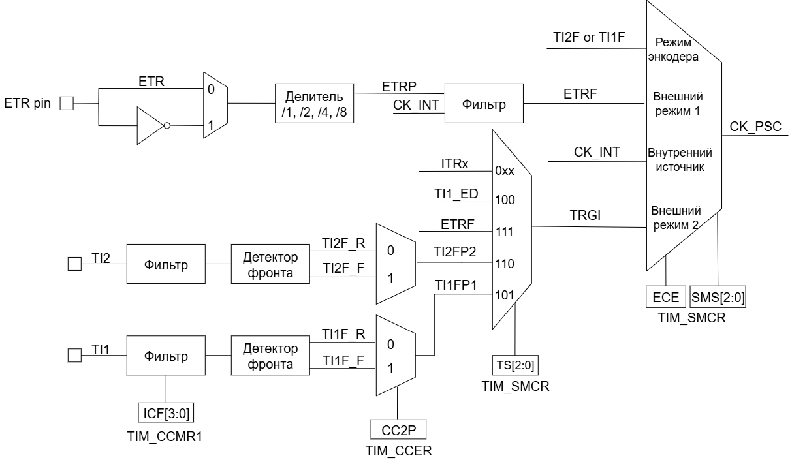
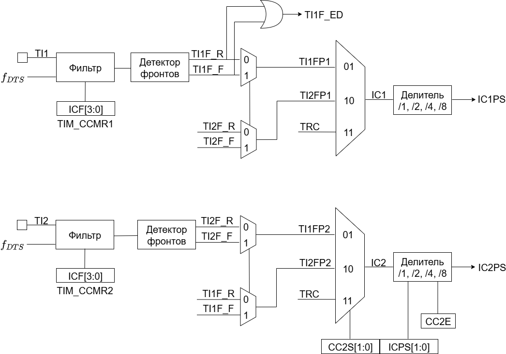
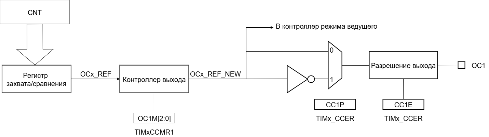
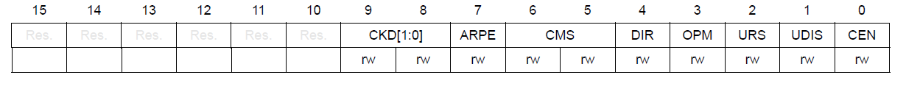
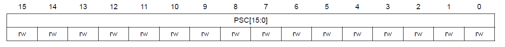
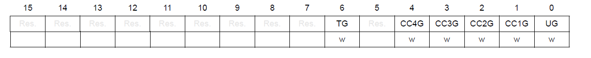
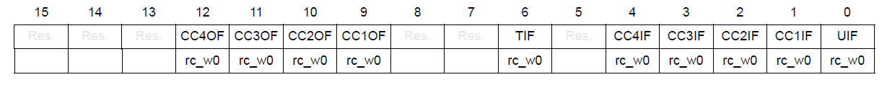
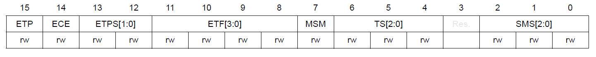
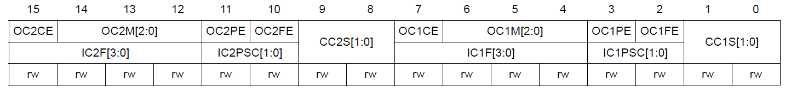

# Спецификация на блок GPT
## Структурная схема 

В состав таймера входят 3 основных блока:  
 1. Time-base unit.  
 2. Master/Slave Mode Controller.  
 3. Канал TIM.

### Time-base unit
Данный блок включает в себя:  
 * Основной счетчик таймера CNT
 * Регистр автоматической перезагрузки (ARR)  
    Данный регистр задает основание счета для счетчика CNT. Счетчик регулярно сравнивает свое значение со значением из ARR. Когда происходит overflow (при счете вверх) или underflow (при счете вниз), генерируется сигнал UEV (Update Event).  
    ARR состоит из двух регистров:  
    * **Preload Register**  — регистр предварительной загрузки. Этот регистр можно настраивать через программный интерфейс. Когда формируется событие UEV, значение из регистра предварительной загрузки помещается в теневой регистр.
    * **Shadow Register** — теневой или активный регистр. Теневой регистр является *внутренним* и недоступен программисту. Именно с теневым регистром происходит сравнение значения счетчика.  
 * Prescaler (PSC) — программно настраиваемый делитель частоты. Служит для деления частоты, тактирующей основной счетчик CNT. Программный регистр делителя, который содержит коэффициент деления, также имеет теневой регистр. Приницп работы такой же, как и для ARR.

#### Режим счета вверх
В этом режиме счетчик считает вверх от 0 до значения в регистре автоматической перезагрузки (ARR). Этот режим включается путем установки бита DIR = 0 в программном регистре TIM_CR1. При переполнении счетчика генерируется событие UEV (Update Event), также выставляется флаг прерывания UIF (Update Interrupting Flag).  
Событие обновления (UEV) может быть отключено путем программной установки значения UDIS в регистре TIMx_CR1. Это позволяет не обновлять теневые регистры во время записи новых значений в регистры предварительной загрузки.
#### Режим счета вниз
В этом режиме счетчик считает от значения в регистре автоматической перезагрузки (ARR) до 0. Этот режим включается путем установки DIR = 1 в регистре TIM_CR1. Когда счетчик досчитывает до 0, генерируется событие «анти переполнения» (underflow).
#### Режим счета вверх-вниз
В этом режиме счетчик считает от 0 до значение TIM_ARR – 1, генерирует событие переполнения счетчика (overflow), затем начинает считать от значения TIM_ARR до 1, после чего генерирует событие «анти переполнения» счетчика (underflow).  
В этом режиме управление направлением счета осуществляется другим способом(поле DIR недоступно для записи). Для управления счетчиком используются биты CMS регистра TIM_CR1.  

Собыие обновление (UEV) может генерироваться:  
 * При каждом **overflow**
 * При каждом **underflow**
 * При установке бита UG в регистре TIM_EGR (программно или с помощью **Slave Mode Controller**)  

Генерацию события можно запретить установив бит UDIS в регистре TIM_CR1.  
Обычно, когда генерируется событие UEV, то вместе с ним формируется флаг UIF (Update Interrupt Flag). Но если установить бит URS в регистре TIM_CR1, то запрос на прерывание формироваться не будет.  

Флаг UIF формируется в одноименном поле в статусном регистре таймера TIM_SR1.

### Slave Mode Controller
Этот блок формирует управляющие сигналы для блока Time-base unit. Также этот блок может обрабатывать внешние события (ETR) и генерировать события для других таймеров (TRGO).  

В этом блоке есть схема для выбора источника тактирования основного счетчика. Тактирование может осуществляться следующими источниками:  
 * Внутренний тактовый сигнал $F_{CK}{_{INT}}$ 
 * Режим внешнего тактирования №1: таковый сигнал берется с вывода канала таймера TIMx.  
 * Режим внешнего тактирования №2: внешний тактовый сигнал поступает на вход внешнего триггера (ETR).  
 * Внутренние триггеры от других таймеров TIMx.

 

### Синхронизация таймера с внешними сигналами
Таймеры могут быть синхронизированы с внешними событиями в трех режимах:  
* Режим сброса  
* Режим стробирования
* Триггерный режим  
#### Режим сброса  
Например, можно сбрасывать счетчик по переднему или по заднему фронту сигнала с канала TI1. Для этого необходимо:  
 1. Настроить фильтр входного сигнала в канале TI1, задав небходимую длительность сигнала с помощью поля IC1F в регистре TIM_CCMR1.  
 2. Выбрать фронт, по которому будет происходить сброс таймера (передний или задний). Это делается с помощью настройки поля CC1P в регистре TIM_CCER.  
 3. Далее нужно выбрать событие для сигнала TRGI. В данном примере нужно мультиплексировать значение сигнала TI1 на провод TRGI. Для этого необходимо настроить поле **TS = 101** в регистре TIM_SMCR.  
 4. Далее нужно выбрать режим внешнего тактирования. Необходимо выбрать тактирование сигналом TRGI и установить режим сброса. Для этого нужно установить поле ECE регистра TIM_SMCR в 0, а поле **SMS = 100**.  
 5. Теперь по заданному фронту сигнала на канале TI1 будет происходить сброс основного счетчика CNT и обновление теневых регистров TIM_ARR и TIM_CCRx, если буфферизация этих регистров включена.
 ### Режим стробирования  
 В этом режиме запуск/остановка счетчика зависит от уровня внешнего сигнала. Например, можно контролировать работу основного счетчика CNT c помощью сигнала с канала TI1. Для этого необходимо:  
 1. Настроить фильтр входного сигнала в канале TI1, задав небходимую длительность сигнала с помощью поля IC1F в регистре TIM_CCMR1.  
 2. Выбрать фронт, по которому будет происходить запуск или остановка таймера (передний или задний). Это делается с помощью настройки поля CC1P в регистре TIM_CCER.   
 3. Далее нужно выбрать событие для сигнала TRGI. В данном примере нужно мультиплексировать значение сигнала TI1 на провод TRGI. Для этого необходимо настроить поле **TS = 101** в регистре TIM_SMCR. 
 4. Далее нужно выбрать режим внешнего тактирования. Необходимо выбрать тактирование сигналом TRGI и установить режим стробирования. Для этого нужно установить поле ECE регистра TIM_SMCR в 0, а поле **SMS = 101**.  
 5. Теперь работа счетчика регулируется уровнем сигнала на канале TI1. При запуске или остановке счетчика устанавливается флаг TIF в регистре TIM_SR1. Если разрешены генерация прерывания или запросы к DMA, то они также будут сгенерированы.  
 ### Режим триггера   
 В этом режиме счетчик может быть запущен по внешнему событию на входе.
### Master Mode Controller
Таймер может не только принимать и реагировать на внешние события, также он может генерировать события TRGO для других таймеров. Таким образом, можно делать каскады из таймеров.  
**Master Mode Controller** может работать в следующих режимах:  
 * Один таймер явялется преддедлителем для другого таймера (one timer prescaler for another)  
 * Один таймер генерирует сигнал **enable** для другого таймера (one timer enable for another)  
 * Один таймер запускает другой таймер (one timer to tart for another timer)
### Канал TIM
Канал таймера можно сконфигурировать на вход (режим захвата) и на выход (режим сравнения).
#### Режим захвата  
На схеме ниже представлены 2 канала таймера, которые сконфигурированы в режиме входа (захвата). 
С вывода МК сигнал поступает на фильтр, где отбрасываются импульсы, длительность которых меньше заданной. Дальше сигнал попадает на детектор фронтов. Дальше идет мультиплексор, который выбирает необходимую полярность сигнала. То есть на этом этапе принимается решение, на какое событие будет реагировать регистр захвата/сравнения (CCRx) — передний фронт сигнала или задний. В результате мультиплексирования получается сигнал ICx, который попадает на делитель частоты. Делитель нужен для того, чтобы регистр захвата не перехватывал значение счетчика очень часто — это сильно снижает производительность всей системы. В конечном итоге формируется сигнал ICxPS Сигнал **ICxPS** — сигнал, который управляет регистром захвата/сравнения.

#### Input PWM Mode
Режим входного ШИМ-сигнала является частным случаем режима захвата. Для этого сигнала с одного канала (например, TI1) надо разветвить и направить на выход 1 и 2. Сигнал TI1FP1 будет управлять регистром CCR1, а сигнал TI1FP2 — CCR2. Таким образом для сигнала TI1FP1 можно настроить активный фронт — передний, а для сигнала TI1FP2 — задний. И в момент переднего фронта сигнала в регистр CCR1 будет сохраняться одно значение счетчика. В момент заднего фронта сигнала в регистр CCR2 будет сохраняться следующее значение счетчика. В итоге, мы сможем посчитать скважность входного сигнала по формуле:  
Duty cycle = $\frac{CCR2}{CCR1}\cdot 100$%  

  

#### Режим сравнения  
  

В режиме сравнения вывод таймера сконфигурирован как выход. Когда значение счетчика совпадает со значением регистра захвата/сравнения TIM_CCR, то уровень выходного сигнала меняется в зависимости от поля OCxM в регистре TIM_CCMR. Сигнал обновления UEV не влияет ни на счет, ни на выходной сигнал таймера.  
Можно генерировать прерывания и запрос к DMA.  

#### Output PWM Mode

## Сигналы ввода-вывода

## Интерфейсы

## Программная модель
### Управляющий регистр таймера №1 (TIM_CR1)

 * Биты 15:10 не используются  
 * Биты 9:8 **CKD**: Коэффициент деления частоты цифрового фильтра  
    С помощью этого поля можно управлять формированием отфильтрованного сигнала с частотой $F_{DTS}$,  
    00: $F_{DTS} = F_{INT}$  
    01: $F_{DTS} = \frac{F_{INT}}{2}$  
    10: $F_{DTS} = \frac{F_{INT}}{4}$  
    11: не используется  
 * Бит 7 **APRE**: Разрешение предзагрузки  
    0: Теневой регистр ARR отключен — значение берется напрямую из регистра предварительной загрузки  
    1: Теневой регистр активен  
 * Биты 6:5 **CMS**:  Выбор режима центрового выравнивания  
    00: Счтчик считает **либо** вверх, **либо** вниз, в зависимости от поля **DIR**  
    01: Счетчик считает вверх **и** вниз. Флаг UEV выставляется, когда счетчик считает вниз.  
    10: Счетчик считает вверх **и** вниз. Флаг UEV выставляется, когда счетчик считает вверх.  
    11: Счетчик считает вверх **и** вниз. Флаг UEV выставляется, когда счетчик считает вниз **и** вверх.  
 * Бит 4 **DIR**: Направление счета (вверх/вниз)  
    0: Счетчик считает вверх
    1: Счетчик считает вниз  
 * Бит 3 **OPM**: Режим формирования строба  
    0: Счетчик не останавливается после формирования события обновления (UEV)  
    1: Счетчик останавливается после формирования события обновления (UEV) — бит CEN снимается  
 * Бит 2 **URS**: Источник запроса на обновление  
   0: Любое из этих событий генерирует прерывание по обновлению (UIF) или запрос DMA  
    * Overflow или Underflow  
    * Установка бита UG  
    * Генрация обновления через Slave Mode Controller  

   1: Только overflow или underflow генерирует UIF или запрос к DMA

 * Бит 1 **UDIS** Запрет обновления  

 * Бит 0 **CEN** Включения счетчика  
    0: Счетчик остановлен  
    1: Счетчик запущен  

### Регистр предделителия TIM_PSC
  
Содержит коэффициент деления от 1 до 65536.

### Регистр генерации событий TIM_EGR
  

 * Бит 0 **UG**: Генерация обновления  
 0: Никаких изменений
 1: Счетчик сбрасывается в 0, если DIR = 0 (счет вверх). Счетчик устанавливается в значение TIM_ARR, если DIR = 1 (счет вниз). Счетчик предделителя также сбрасывается, но коэффициент деления остается таким же.

### Статусный регистр таймера TIM_SR1
  

 * Бит 0 **UIF**: Флаг прерывания по обновлению  
   Этот бит устанавливается аппаратно, но сбрасывается программно.

### Регистр контроллера ведомого режима TIM_SMCR
  

 * Бит 15 **ETP**: Полярность внешнего триггера  
   0: ETR не инвертирован — активный сигнал — всоходящий фронт.  
   1: ETR инвертирован — активный сигнал — нисходящий фронт.  

* Бит 14 **ECE**: Разрешение внешнего тактирования  
   Этот бит включает режим внешнего тактирования №2.
   0: Режим внешнего тактового сигнала отключен.  
   1: Режим внешнего тактового сигнала включен. Счетчик тактируется сигналом ETRF.

* Биты 13:12 **ETPS**: Предделитель внешнего сигнала  
   Частота внешнего сигнала ETRP может быть понижена с помощью делителя.  
   00: Предделитель отключен.
   01: Частота ETRP делится на 2.
   10: Частота ETRP делится на 4.
   11: Частота ETRP делится на 8.  

* Биты 11:8 **ETF**: Фильтр внешнего триггера  
   Это поле определяет частоту сэмплирования входного сигнала.  
   0000: Фильтрации нет  
   0001: $f_{SAMPLING}$ = $f_{CKINT}$, N = 2  
   0010: $f_{SAMPLING}$ = $f_{CKINT}$, N = 4  
   0011: $f_{SAMPLING}$ = $f_{CKINT}$, N = 8  
   0100: $f_{SAMPLING}$ = $\frac{f_{DTS}}{2}$, N = 6  
   0101: $f_{SAMPLING}$ = $\frac{f_{DTS}}{2}$, N = 8  
   0110: $f_{SAMPLING}$ = $\frac{f_{DTS}}{4}$, N = 6  
   0111: $f_{SAMPLING}$ = $\frac{f_{DTS}}{4}$, N = 8  
   1000: $f_{SAMPLING}$ = $\frac{f_{DTS}}{8}$, N = 6  
   1001: $f_{SAMPLING}$ = $\frac{f_{DTS}}{8}$, N = 8  
   1010: $f_{SAMPLING}$ = $\frac{f_{DTS}}{16}$, N = 5  
   1011: $f_{SAMPLING}$ = $\frac{f_{DTS}}{16}$, N = 6  
   1100: $f_{SAMPLING}$ = $\frac{f_{DTS}}{16}$, N = 8  
   1101: $f_{SAMPLING}$ = $\frac{f_{DTS}}{32}$, N = 5  
   1110: $f_{SAMPLING}$ = $\frac{f_{DTS}}{32}$, N = 6  
   1111: $f_{SAMPLING}$ = $\frac{f_{DTS}}{32}$, N = 8  

* Бит 7 **MSM**  

 * Биты 6:4 TS: Выбор триггера  
   Это поле выбирает входной сигнал триггера, который используется для тактирования счетчика.  
   000: Внутренний триггер 0 (ITR0)  
   001: Внутренний триггер 1 (ITR1)  
   010: Внутренний триггер 2 (ITR2)  
   011: Внутренний триггер 3 (ITR3)  
   100: Детектор фронтов входа TI1 (TI1F_ED)  
   101: Фильтрованный вход таймера 1 (TI1FP1)  
   110: Фильтрованный вход таймера 2 (TI2FP2)  
   111: Вход внешнего триггера ETRF  

* Биты 2:0 **SMS** Выбор ведомого режима  
   000: Ведомый режм отключен — если **CEN == 1**, то счетчик тактируется от внутреннего тактового сигнала.  
   001: Режим энкодера 1 — Счетчик считает вверх/вниз по фронту сигнала TI1FP1 в зависимости от уровня сигнала TI2FP2.  
   010: Режим энкодера 2 — Счетчик считает вверх/вниз по фронту сигнала TI2FP2 в зависимости от уровня сигнала TI1FP1.  
   011: Режим энкодера 3 — Счетчик считает вверх/вниз по обоим фронтам сигналов TI1FP1 и TI2FP2 в зависимости от уровня другого входа.  
   100: Режим сброса — Передний фронт выбранного триггерного входа (TRGI) повторно инициализирует счетчик и вызывает обновление регистров.  
   101: Режим стробирования — актирование счетчика разрешено, когда триггерный вход (TRGI) находится в высоком уровне. Счетчик останавливается (но не сбрасывается), как только триггер переходит в низкий уровень. Контролируются как запуск, так и остановка счетчика.  
   110: Триггерный режим — Счетчик запускается по переднему фронту триггера TRGI (но не сбрасывается). Контролируется только запуск счетчика.  
   111: Режим внешнего тактового сигнала 1 — Передние фронты выбранного триггера (TRGI) тактируют счетчик.

### Регистр режима захвата/сравнения №1 (TIM_CCMR1)
  

 * Бит 15 **OC2CE**: Разрешение сброса по сравнению 2  
 * Бит 14:12 **OC2M[2:0]**: Режим сравнения на выходе 2
 * Бит 11 **OC2PE**: Разрешение предварительной загрузки для сравнения 2  
 * Бит 10 **OC2FE**: Режим быстрого включения для сравнения 2  
 * Биты 9:8 **CC2S[1:0]**: Выбор режима захвата/сравнения 2  
   00: Канал CC2 настроен как **выход**  
   01: Канал CC2 настроен как **вход**, IC2 подключен к TI2  
   10: Канал CC2 настроен как **вход**, IC2 подключен к TI1  
   11: Канал CC2 настроен как вход, IC2 подключен к TRC. Этот режим работает только если внутренний вход триггера выбран через биты TS (регистр TIMx_SMCR).  
 * Биты 6:4 **OC1M**: Режим сравнения выхода 1  
   000: Заморозка — Сравнение значения счетчика CNT и регистра TIM_CCR1 не влияет на значение выхода.  
   001: Установка выходного опорного сигнала OC1REF в высокий уровень при CNT == TIM_CCR1.  
   010: Установка выходного опорного сигнала OC1REF в низкий уровень при CNT == TIM_CCR1.  
   011: Уровень выходного опорного сигнала меняется на противоположный.  
   100: Установка в **принудительно** низкий уровень.  
   101: Установка в **принудительно** высокий уровень.  
   110: ШИМ режим 1  
      * При счете вверх: канал 1 активен, пока TIMx_CNT < TIMx_CCR1, в противном случае неактивен.  
      * При счете вниз: канал 1 неактивен (OC1REF='0'), пока TIMx_CNT > TIMx_CCR1, в противном случае активен (OC1REF=1).  
   111: ШИМ режим 2  
      * При счете вверх: канал 1 неактивен, пока TIMx_CNT < TIMx_CCR1, в противном случае активен.  
      * При счете вниз: канал 1 активен, пока TIMx_CNT > TIMx_CCR1, в противном случае неактивен.

### Регистр разрешения захвата/сравнения (TIM_CCER)
  

* Бит 0 **CC1E**: Разрешение выхода захвата/сравнения 1  
   Если канал сконфигурирован как **выход**:  
      0: Выход не активен  
      1: Выход активен  
   Если канал сконфигурирован как **вход**:  
      0: Захват запрещен  
      1: Захват разрешен  
* Бит 1 **CC1P**: Полярность выхода захвата/сравнения 1  
   Если канал сконфигурирован как **выход**:  
      0: Выход с активной единицей  
      1: Выход с активным нулем  
   Если канал сконфигурирован как **вход**:  
   Бит CC1P вместе с битом CC1NP выбирает полярность отфильтрованных сигналов TI1FP1 и TI2FP2 для операций захвата.  
      00: Неинвертированный, передний фронт — активный  
      01: Инвертированный, задний фронт — активный  
      10: Не используется  
      11: Неинвертированный, оба фронта активные. Нельзя использовать в режиме энкодера.  

* Бит 2: Не используется  
* Бит 3 **CC1NP** Полярность выхода сравнения/захвата 1  
   Если канал сконфигурирован как **выход**:  
   Это поле должно быть сброшено в 0.  
   Если канал сконфигурирован как **вход**:  
   Используется вместе с битом CC1P для определения полярности сигналов TI1FP1/TI2FP1. См. описание бита CC1P.  
* Бит 4 **CC2E** Разрешение выхода захвата/сравнения 2  
   Аналогично CC1E  
* Бит 5 **CC2P**: Полярность выхода захвата/сравнения 2  
   Аналогично CC1P  
* Бит 6: Не используется  
* Бит 7: **CC2NP**: Полярность выхода захвата/сравнения 2  
   Аналогично CC1NP  
* Бит 8: **CC3E**: Разрешение выхода захвата/сравнения 3  
   Аналогично CC1E  
* Бит 9 **CC3P**: Полярность выхода захвата/сравнения 3  
   Аналогично CC1P  
* Бит 10: Не используется  
* Бит 11: **CC3NP**: Полярность выхода захвата/сравнения 3  
   Аналогично CC1NP  
* Бит 12: **CC4E**: Разрешение выхода захвата/сравнения 4  
   Аналогично CC1E  
* Бит 13 **CC4P**: Полярность выхода захвата/сравнения 4  
   Аналогично CC1P  
* Бит 14: Не используется  
* Бит 15: **CC4NP**: Полярность выхода захвата/сравнения 4    
   Аналогично CC1NP  
